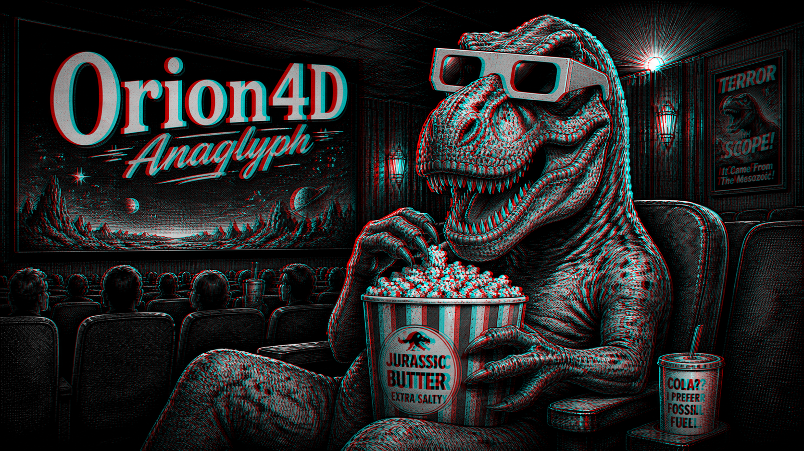

🇬🇧 English version (default)  
🇫🇷 [Lire la version française](README_FR.md)

# 🎭 Orion4D Anaglyph for ComfyUI



**Orion4D Anaglyph** is a high-performance custom node designed to transform 2D images into stereoscopic (3D) renders via a depth map. It offers total control over parallax, convergence, and depth processing to ensure optimal visual comfort.

---

## 🚀 Key Features

* **Total Compatibility**: Works seamlessly with Depth Anything (V2/V3), Marigold, ZoeDepth, MiDaS, or even hand-edited maps.
* **Various Rendering Modes**: Supports Red/Cyan (Dubois, Color, Gray) and Red/Blue modes.
* **Multiple Outputs**: Generates the final anaglyph, Side-by-Side (SBS) format, isolated left/right views, and the processed depth map.
* **Preset Manager**: Integrated JS interface to save, load, and update your favorite settings on the fly.
* **Native Processing**: Optimized PyTorch implementation for maximum speed and cross-platform compatibility.


---

## 🛠 Installation

Copy the `Orion4D_anaglyph` folder into your custom nodes directory:

```text
ComfyUI/custom_nodes/Orion4D_anaglyph
```
## Requirements

No additional Python dependencies are required beyond a standard ComfyUI installation.

This custom node uses only modules already available in ComfyUI:

- torch
- aiohttp
- ComfyUI PromptServer
- Python standard library modules
### Folder Structure
```text
Orion4D_anaglyph/
├── orion4d_anaglyph.py    # Core logic
├── preset_manager.py      # JSON management
├── web/                   # User Interface (JS)
└── presets/               # Your saved configurations
```
---

## ⚙️ Configuration Parameters

| Parameter | Description | Recommended Value |
| :--- | :--- | :--- |
| **strength** | 3D effect intensity (parallax). | `16` to `32` |
| **convergence** | Focal point where the image appears to sit on the screen plane. | `0.5` |
| **shift_mode** | Offset method (`symmetric`, `left_static`, `right_static`). | `symmetric` |
| **depth_blur** | Smoothes edges to reduce visual artifacts. | `5` to `9` |
| **depth_invert** | Inverts depth if the relief appears backwards. | Per source |

---

## 🔄 Workflow
* Drag and drop orion4d_anaglyph_workflow.png onto the comfy canvas
* The node is best placed immediately after a depth estimator:

```text
[ Source Image ] 
      │
      ├─► [ Depth Anything V3 ] ──► (Depth Map) ──┐
      └───────────────────────────► (RGB Image)  ──┴─► [ Orion4D Anaglyph ]
                                                              │
                                        ┌─────────────────────┴─────────────────────┐
                                  [ Anaglyph ]        [ Side-by-Side ]        [ Left/Right ]
```

---

## 🎨 Available Anaglyph Modes

* **Optimized Dubois (Red/Cyan)**: The gold standard for color fidelity and ghosting reduction.
* **Color / Half-Color**: Preserves more of the original vibrancy at the cost of potential color fringing.
* **Gray**: Ideal for maximum depth clarity without chromatic distraction.

---

## 🆘 Troubleshooting & Tips

### 👁️ Eye Strain?
* Reduce the `strength` value.
* Adjust `convergence` to place the main subject on the screen plane.
* Increase `depth_blur`.

### 🔀 Inverted 3D Effect?
1. Enable `depth_invert`.
2. If the issue persists, use the `swap_eyes` option.

### 🖼️ Edge Stretching (Warping)
This is a standard limitation of 2D-to-3D reprojection. To minimize it:
* Use `padding_mode: border`.
* Reduce `depth_contrast`.
* Use a higher-precision depth map (e.g., Depth Anything V3 Large).

---

### 🌟 **Support the Project**
If you find this tool useful, feel free to leave a ⭐ on GitHub!

**Developed with ❤️ for the ComfyUI community by Orion4D**

<a href="https://ko-fi.com/orion4d">

</a>
